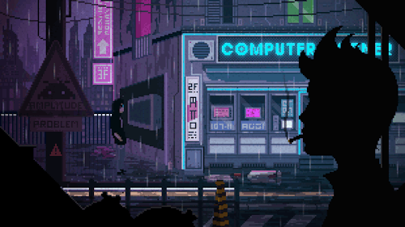

    

    
    

        Estudante de Ciências da Computação! 
        Atualmente trabalho com **PHP** 🐘 e estou sempre em busca de novos desafios na área de tecnologia. Estou constantemente atualizando meus conhecimentos e aprendendo novas ferramentas. 
        Fora do trabalho, meu foco principal é aprimorar meus conhecimentos em **React** para o Frontend e continuar explorando **PHP** para o desenvolvimento web, além de estudar frameworks como o **Tailwind CSS**.
    

##

<h3>My stacks:</h3>

 
    
    
    
    
    
    
    

    <h3 align="left">Connect with me!</h3>
    
    
    

  <h3 style="color: #4028D4; margin-bottom: 20px;">* GitHub Stats *</h3>
  
  

#

<picture align="center">
    <source media="(prefers-color-scheme: dark)" srcset="https://raw.githubusercontent.com/YagoB16/YagoB16/output/github-contribution-grid-snake-dark.svg">
    <source media="(prefers-color-scheme: light)" srcset="https://raw.githubusercontent.com/YagoB16/YagoB16/output/github-contribution-grid-snake-dark.svg">
    
</picture>
